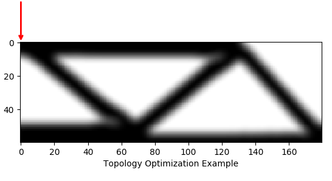

# TopOpt — Topology Optimization in Python

**A Python Library for Topology Optimization**

<!-- <a href="https://pypi.org/project/topopt/">
    
</a> -->
[](https://travis-ci.com/zfergus/topopt)
[](https://pytopopt.readthedocs.io/en/latest/?badge=latest)
[](https://opensource.org/licenses/MIT)

**Warning:** this library is in early stages of development and consequently
the API may change to better improve usability.

[Topology optimization](https://en.wikipedia.org/wiki/Topology_optimization)
is a form of structure optimization where the design variable is the topology
of the structure. Topological changes are achieved by optimizing the material
distribution within a given design space.

TopOpt is a python library for topology optimization. TopOpt contains common
design problems (e.g. minimum compliance) solved using advanced methods
(e.g. Method of Moving Asymptotes (MMA)). Using TopOpt we can optimize the
classic Messerschmitt–Bölkow–Blohm (MBB) beam in a few lines of code:

```python
import numpy
from topopt.boundary_conditions import MBBBeamBoundaryConditions
from topopt.problems import ComplianceProblem
from topopt.solvers import TopOptSolver
from topopt.filters import DensityBasedFilter
from topopt.guis import GUI

nelx, nely = 180, 60  # Number of elements in the x and y
volfrac = 0.4  # Volume fraction for constraints
penal = 3.0  # Penalty for SIMP
rmin = 5.4  # Filter radius

# Initial solution
x = volfrac * numpy.ones(nely * nelx, dtype=float)

# Boundary conditions defining the loads and fixed points
bc = MBBBeamBoundaryConditions(nelx, nely)

# Problem to optimize given objective and constraints
problem = ComplianceProblem(bc, penal)
gui = GUI(problem, "Topology Optimization Example")
topopt_filter = DensityBasedFilter(nelx, nely, rmin)
solver = TopOptSolver(problem, volfrac, topopt_filter, gui)
x_opt = solver.optimize(x)

input("Press enter...")
```

**Output:**

<p align="center">

</p>

## Development Status

TopOpt is in early stages of development and only features a limited set of
finite element mesh options, optimization problems, and solvers. The following
is a list of current and future features of TopOpt:

### Meshes
* [x] 2D regular grid
* [ ] 2D general mesh
    * [ ] triangle mesh
    * [ ] quadrilateral mesh
* [ ] 3D regular grid
* [ ] 3D general mesh
    * [ ] tetrahedron mesh
    * [ ] hexahedron mesh

### Problems
* [ ] compliance
    * [x] linear elasticity
    * [ ] non-linear elasticity
* [ ] stress
* [ ] thermal conductivity
* [ ] fluid flow

### Solvers
* [ ] [optimality criterion](https://en.wikipedia.org/wiki/Optimality_criterion)
* [x] Method of Moving Asymptotes (MMA)
* [ ]  [genetic algorithms](https://en.wikipedia.org/wiki/Genetic_algorithm)
