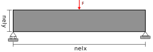
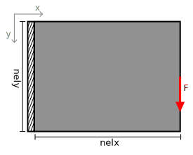
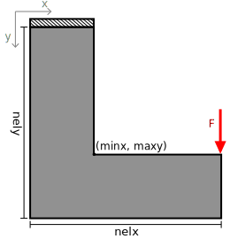
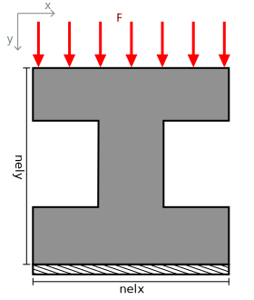
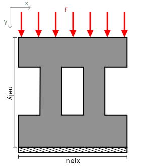

Boundary Conditions
===================

.. automodule:: topopt.boundary_conditions

Base Boundary Conditions
------------------------

.. autoclass:: topopt.boundary_conditions.BoundaryConditions
    :members:
    :undoc-members:
    :special-members: __init__

All Boundary Conditions
-----------------------

This section contains all boundary conditions currently implemented in the
library. It is not yet comprehensive, so it would be really nice if you can
help me add more!

MBB Beam
~~~~~~~~

.. autoclass:: topopt.boundary_conditions.MBBBeamBoundaryConditions
    :members:
    :undoc-members:
    :special-members: __init__

Cantilever
~~~~~~~~~~

.. autoclass:: topopt.boundary_conditions.CantileverBoundaryConditions
    :members:
    :undoc-members:
    :special-members: __init__

L-Bracket
~~~~~~~~~

The L-bracket is a bracket in the shape of a capital "L". This domain is achieved
using a passive block in the upper right corner of a square domain.

The passive block is defined by its minimum x coordinate and the maximum y
coordinate.

.. autoclass:: topopt.boundary_conditions.LBracketBoundaryConditions
    :members:
    :undoc-members:
    :special-members: __init__

I-Beam
~~~~~~

The I-beam is a cross-section of a beam in the shape of a capital "I". This
domain is achieved using two passive blocks in the middle left and right of a
square domain.

.. autoclass:: topopt.boundary_conditions.IBeamBoundaryConditions
    :members:
    :undoc-members:
    :special-members: __init__

II-Beam
~~~~~~~

The II-beam is a cross-section of a beam in the shape of "II". This
domain is achieved using three passive blocks in the middle left, center, and
right of a square domain.

.. autoclass:: topopt.boundary_conditions.IIBeamBoundaryConditions
    :members:
    :undoc-members:
    :special-members: __init__
