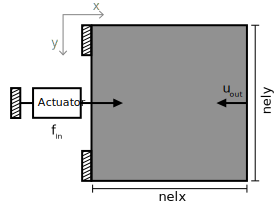

Boundary Conditions
===================

.. automodule:: topopt.mechanisms.boundary_conditions

Mechanism Synthesis Boundary Conditions
---------------------------------------

.. autoclass:: topopt.mechanisms.boundary_conditions.MechanismSynthesisBoundaryConditions
    :members:
    :undoc-members:
    :special-members: __init__

Displacement Inverter
~~~~~~~~~~~~~~~~~~~~~

.. autoclass:: topopt.mechanisms.boundary_conditions.DisplacementInverterBoundaryConditions
    :members:
    :undoc-members:
    :special-members: __init__

Gripper
~~~~~~~

.. .. image:: ../../../assets/imgs/boundary-conditions/mechanisms/displacement-inverter.svg
..     :alt: Displacement inverter
..     :width: 60%
..     :align: center

.. autoclass:: topopt.mechanisms.boundary_conditions.GripperBoundaryConditions
    :members:
    :undoc-members:
    :special-members: __init__

Cross Sensitivity
~~~~~~~~~~~~~~~~~

.. .. image:: ../../../assets/imgs/boundary-conditions/mechanisms/displacement-inverter.svg
..     :alt: Displacement inverter
..     :width: 60%
..     :align: center

.. autoclass:: topopt.mechanisms.boundary_conditions.CrossSensitivityExampleBoundaryConditions
    :members:
    :undoc-members:
    :special-members: __init__
